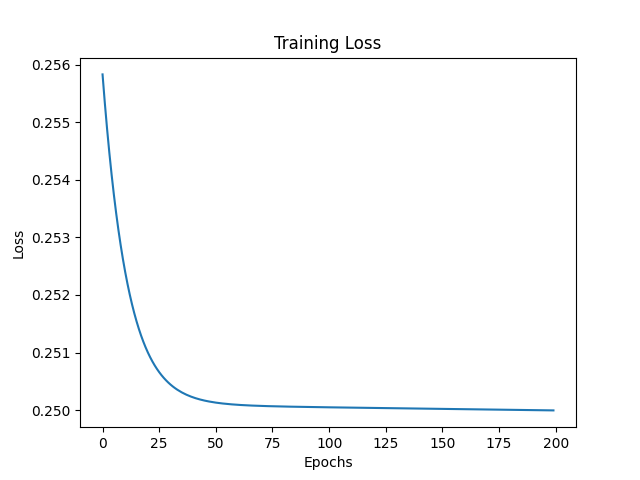

# aiml-tiny-neural-network
Building a tiny neural network using only python( No ML libraries like tensorflow)
# Tiny Neural Network From Scratch

This project implements a tiny neural network from scratch using Python without TensorFlow or PyTorch.

## Network Architecture
- 2 input neurons
- 1 hidden layer with 2 neurons
- 1 output neuron

## Dataset
- XOR dataset

## Training
- Activation function: Sigmoid
- Loss function: Mean Squared Error
- Optimizer: Gradient Descent
- Epochs: 200

## Output
Training loss decreases over epochs as shown below:



## How to Run
```bash
pip install numpy matplotlib
python task1.py
